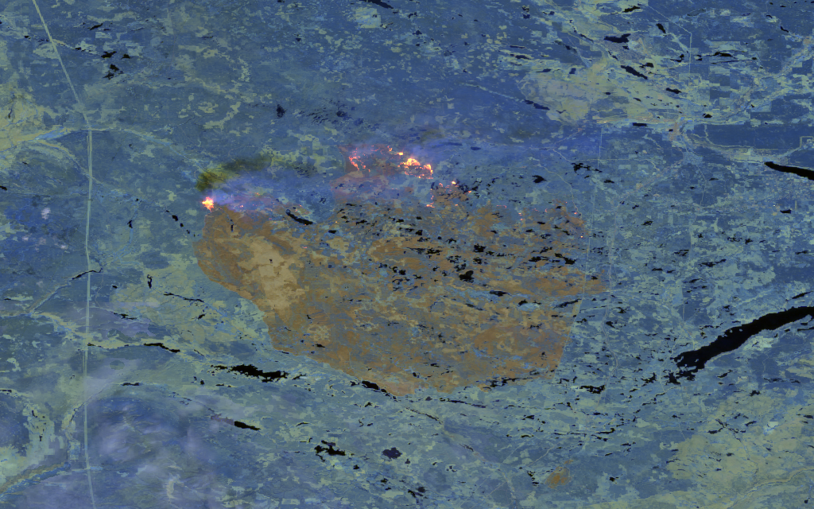

# Proof Of Concept, Generate Fire Boundaries using Google Earth Engine

[](https://github.com/bcgov/repomountie/blob/master/doc/lifecycle-badges.md)

## About

This is a proof of concept to generate fire boundaries using Google Earth Engine.

The goal is to prove the utility of generating fire perimeter from satellite imagery, thus reducing the need for manual generation of perimeters using helicopters.

Issue: Current implementation dependant on cloud cover! Current algorithm doesn't work with lots of cloud and smoke. Smoke may cause holes in the perimiter. Consider using MODIS + VIIRS as source.

Issue: Need a government google account to productionize this.


Credit: The code that identifies fire is basead on code by https://github.com/ashlinrichardson available at:
https://github.com/bcgov/wps-research/blob/master/py/gee/active_fire.js

## Process / Components

```mermaid
flowchart LR

    subgraph Openshift
        job["Scheduled Job</br>Runs daily, generates fire perimeters for active fires > 90ha.</br>Uses publicically available data."]
        postgis[(PostGIS)]
        subgraph Servers
            pg_featurserv["pg_featurserv</br>A lightweight RESTful geospatial feature server for PostGIS."]
            rasterserv["Raster Server</br>Serve up GeoTIFF files."]
        end
    end
    WFS["https://openmaps.gov.bc.ca"]
    GEE["Google Earth Engine(GEE)"]
    s3[S3 Compliant, OCIO Object Storage Service]
    user("User with GIS software/Browser")

    job--"Query active fires > 90ha"-->WFS
    job--"Generate fire perimeter GeoTIFF"-->GEE
    job--"Store polygonized fire perimeter"-->postgis
    job--"Store fire GeoTIFF"-->s3
    pg_featurserv--"Serve features for GIS"-->postgis
    rasterserv--"Serve fire GeoTIFF"-->s3
    user--"OCG API"-->pg_featurserv
    user-->rasterserv

```

## Demo

Proof of concept demo: [https://wps-dev-featureserv.apps.silver.devops.gov.bc.ca/](https://wps-dev-featureserv.apps.silver.devops.gov.bc.ca/)

### pg-featureserv screenshot


### GeoTIFF screenshot



## General

- Create `.env` file (you can copy `.env.example` and set appropriate values)
- Assumes use of python poetry
- Google Earth Engine does not work on versions newer than 3.8.\*

## Ubuntu

```bash
pip3 install pygdal==3.0.4.10 poetry
poetry install
poetry run python -m pip install pygdal==3.0.4.10
make cli
```

### Running
```bash
poetry run python3 -m fire_perimeter.cli
```

## Using macports on m1

I had trouble using pyenv to install the version I need. So installing python with macports, and telling poetry to use the version I want.

```bash
sudo port selfupdate
sudo port upgrade outdated
sudo port install python38
sudo port install gdal
sudo port install proj9
```

Python 3.8 is installed to: /opt/local/Library/Frameworks/Python.framework/Versions/3.8

Find out where proj is installed, and set PROJ_DIR for your environment

```bash
port contents proj9
```

```bash
poetry env use /opt/local/Library/Frameworks/Python.framework/Versions/3.8/bin/python3
poetry run python -m pip install --upgrade pip
poetry install
poetry run python -m pip install gdal==$(gdal-config --version) --no-cache-dir
```

NOTE: --no-cache-dir is very important to make sure that gdal install doesn't skip numpy bindings.
NOTE: order is very important here, you need to have installed numpy before gdal.

## Openshift

### Build image

#### Shortcut!

Taking some shortcuts! Skipping build in openshift, and pushing up from local

```bash
make build
docker tag wps-fire-perimeter:latest image-registry.apps.silver.devops.gov.bc.ca/e1e498-tools/wps-fire-perimeter:latest
docker login -u developer -p $(oc whoami -t) image-registry.apps.silver.devops.gov.bc.ca
docker push image-registry.apps.silver.devops.gov.bc.ca/e1e498-tools/wps-fire-perimeter:latest
```

### Deployment

```bash
oc -n e1e498-dev process -f openshift/templates/perimeter_cronjob.yaml | oc -n e1e498-dev apply -f -
```
